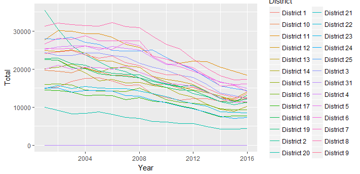

Illegal Activity in Chicago
========================================================
author: Moffett McKenna
date: 3/27/17
autosize: true

Which Direction Are the Trends?
========================================================
type: intro

There has been some recent discussion about the crime rates in Chicago and other metropolitan areas.  Using the data provided by the CLEAR system, crime rates for each Police District are shown for easy comparison.  Overall trends in differnt districts can be seen, and districts can be used to compare effectiveness of the strategies used.


Data Transformation
========================================================
type: data

The original data set (seen below) is over 1 GB of data even in the csv format.  Most of the variables in this dataset are unncessary, as we are only interested in the Year, District, and the crime reported (Primary.Type for a textual represention or IUCR for the Illinois Uniform Crime Reporting code).


```r
crime <- read.csv("Crimes_2001_to_present.csv", nrows = 10)
names(crime)
```

```
 [1] "ID"                   "Case.Number"          "Date"                
 [4] "Block"                "IUCR"                 "Primary.Type"        
 [7] "Description"          "Location.Description" "Arrest"              
[10] "Domestic"             "Beat"                 "District"            
[13] "Ward"                 "Community.Area"       "FBI.Code"            
[16] "X.Coordinate"         "Y.Coordinate"         "Year"                
[19] "Updated.On"           "Latitude"             "Longitude"           
[22] "Location"            
```

This format was both unyieldly and time-consuming to work with.  For this project a more compact form of the data consisting of counts was desired.  This was achieved via the DataTransformation.R script, which reads in the original csv, compacts the data into counts of incidences per charge, and then writes it out to a new csv for use.

This new format is both easier to work, less resource intensive, and provides all the necessary data.


Data Presentation
========================================================
type: data

The primary element is the graph of the total incident counts per District.  The secondary element is a table showing the percentages of incident based on the

Districts can be removed or added to the graph and percentages table, and the years examined can also be changed.  Both the graph and table will update live with the data.
***
**District Counts Graph**

**Percentages Table**
<table>
 <thead>
  <tr>
   <th style="text-align:left;"> District </th>
   <th style="text-align:left;"> Overall </th>
   <th style="text-align:left;"> Arson </th>
   <th style="text-align:left;"> Assualt </th>
   <th style="text-align:left;"> Drugs </th>
   <th style="text-align:left;"> Homicide </th>
   <th style="text-align:left;"> Kidnapping </th>
   <th style="text-align:left;"> Robbery </th>
  </tr>
 </thead>
<tbody>
  <tr>
   <td style="text-align:left;"> District 1 </td>
   <td style="text-align:left;"> 4 % </td>
   <td style="text-align:left;"> 1 % </td>
   <td style="text-align:left;"> 3 % </td>
   <td style="text-align:left;"> 2 % </td>
   <td style="text-align:left;"> 1 % </td>
   <td style="text-align:left;"> 1 % </td>
   <td style="text-align:left;"> 2 % </td>
  </tr>
  <tr>
   <td style="text-align:left;"> District 10 </td>
   <td style="text-align:left;"> 4 % </td>
   <td style="text-align:left;"> 6 % </td>
   <td style="text-align:left;"> 5 % </td>
   <td style="text-align:left;"> 6 % </td>
   <td style="text-align:left;"> 7 % </td>
   <td style="text-align:left;"> 3 % </td>
   <td style="text-align:left;"> 5 % </td>
  </tr>
  <tr>
   <td style="text-align:left;"> District 11 </td>
   <td style="text-align:left;"> 6 % </td>
   <td style="text-align:left;"> 6 % </td>
   <td style="text-align:left;"> 6 % </td>
   <td style="text-align:left;"> 16 % </td>
   <td style="text-align:left;"> 10 % </td>
   <td style="text-align:left;"> 5 % </td>
   <td style="text-align:left;"> 7 % </td>
  </tr>
  <tr>
   <td style="text-align:left;"> District 12 </td>
   <td style="text-align:left;"> 5 % </td>
   <td style="text-align:left;"> 5 % </td>
   <td style="text-align:left;"> 5 % </td>
   <td style="text-align:left;"> 3 % </td>
   <td style="text-align:left;"> 4 % </td>
   <td style="text-align:left;"> 3 % </td>
   <td style="text-align:left;"> 4 % </td>
  </tr>
  <tr>
   <td style="text-align:left;"> District 13 </td>
   <td style="text-align:left;"> 0 % </td>
   <td style="text-align:left;"> 0 % </td>
   <td style="text-align:left;"> 0 % </td>
   <td style="text-align:left;"> 0 % </td>
   <td style="text-align:left;"> 0 % </td>
   <td style="text-align:left;"> 0 % </td>
   <td style="text-align:left;"> 0 % </td>
  </tr>
</tbody>
</table>

Why Use This
========================================================
type: argument

This is a tool for exploration and education.  The key use of it is in planning and program selection.  By looking at the data as presented here the following is possible:

* Identifying increases in other criminal activity despite a drop in a major offense category.
* Observing general changes in criminal activity levels.
* Selecting Districts to test out new programs.
* Selecting Districts whose programs and initiatives are worht copying.
